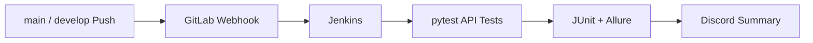

# Elice QA Automation

엘리스 QA 교육 과정에서 진행한 4인 팀 프로젝트 중 제가 맡은 API 테스트, Jenkins 파이프라인, 테스트 결과 알림 작업을 공개 가능한 형태로 정리한 저장소입니다.

원본 팀 저장소를 복사한 것은 아닙니다. 서비스 주소와 테스트 계정, 토큰, 서버 정보, 팀원 개인정보를 제거하고 제 담당 범위를 설명하는 코드와 문서만 다시 구성했습니다.

## 먼저 볼 곳

| 파일 | 확인할 수 있는 내용 |
| --- | --- |
| [`docs/MY_CONTRIBUTIONS.md`](docs/MY_CONTRIBUTIONS.md) | 팀 프로젝트에서 맡은 범위와 협업 내용 |
| [`examples/class_home/test_home_sample.py`](examples/class_home/test_home_sample.py) | 정상·예외·권한·경계값을 나눈 API 테스트 예시 |
| [`ci/Jenkinsfile.example`](ci/Jenkinsfile.example) | Push부터 테스트, 리포트, 알림까지 이어지는 Jenkins 파이프라인 |
| [`tools/send_discord_report.py`](tools/send_discord_report.py) | JUnit/Allure 결과를 읽어 Discord 메시지로 만드는 코드 |
| [`docs/TROUBLESHOOTING.md`](docs/TROUBLESHOOTING.md) | Webhook 403·401, Jenkins 네트워크 설정 등 실제 해결 기록 |

## 프로젝트 요약

| 구분 | 내용 |
| --- | --- |
| 프로젝트 | 교육 서비스 API 품질 검증 및 자동 테스트 운영 |
| 팀 구성 | QA 4명 |
| 담당 | 클래스 홈 API 테스트, Jenkins CI/CD, Discord 결과 알림, 부하 생성 VM 모니터링 |
| 기술 | Python, pytest, Requests, Jenkins, GitLab Webhook, Allure, Discord Webhook, JMeter |
| 팀 최종 검증 | 비공개 DEV 환경 기준 `103 passed, 4 xfailed` |

마지막 수치는 팀 프로젝트 종료 시점의 실행 결과입니다. 현재 공개 저장소는 외부 서비스와 팀 공통 프레임워크를 포함하지 않으므로 같은 수치를 그대로 재현하는 용도는 아닙니다.

## 맡은 작업

### 클래스 홈 API 테스트

- API 호출을 테스트 코드와 분리하기 위해 `HomeAPI` 객체를 만들었습니다.
- 성공 응답뿐 아니라 잘못된 식별자, 필수 헤더 누락, 기관 간 접근, 역할별 수정 권한, `count` 경계값을 확인했습니다.
- HTTP 200만 보고 통과시키지 않고 응답 본문의 업무 상태도 함께 검증했습니다.
- 명세와 실제 응답이 다른 항목은 억지로 통과시키지 않고 `XFail`로 분리했습니다.

### Jenkins CI/CD

- 주기적으로 저장소를 확인하던 Poll SCM 대신 GitLab Push Webhook으로 실행되도록 변경했습니다.
- `main`과 `develop`에 반영된 Push만 실행하도록 GitLab과 Jenkins 양쪽에서 브랜치를 제한했습니다.
- Checkout → 환경 구성 → pytest → JUnit/Allure → Discord 알림 순서로 파이프라인을 구성했습니다.
- 테스트 계정과 Webhook은 Jenkins Credentials에서 실행 시점에만 환경변수로 주입했습니다.

### 테스트 결과 알림

- JUnit XML과 Allure 결과에서 Passed, Failed, Error, Skipped, XFail을 나눠 집계했습니다.
- pytest 노드명보다 읽기 쉬운 Allure 제목을 우선 표시했습니다.
- Discord의 메시지 길이 제한을 넘지 않도록 실패 목록과 본문 길이를 제한했습니다.
- 실제 Webhook을 호출하지 않고 파싱과 요청 payload를 검증하는 단위 테스트를 작성했습니다.

### 부하 테스트 관찰

JMeter 실행 담당자와 역할을 나눠 부하 생성 VM의 CPU와 메모리를 확인했습니다. 5→10→20→30명 단계에서 클라이언트 자원이 먼저 포화되는지 살펴봤고, 서버·DB 지표를 볼 수 없었다는 한계도 결과에 함께 기록했습니다.

## 자동화 흐름



Merge Request 생성만으로는 실행하지 않고 대상 브랜치에 실제 Push가 반영됐을 때 실행했습니다. 당시 팀이 사용한 공유 DEV 환경에 불필요한 부하를 주지 않기 위한 선택이었습니다.

## 로컬에서 확인하기

공개 저장소에서 독립적으로 실행되는 부분은 Discord 알림 모듈의 단위 테스트 4개입니다. 테스트에서는 외부 전송을 모킹합니다.

```bash
python -m venv .venv
pip install -r requirements.txt
python -m pytest tests/test_ci_notification.py
```

`examples/class_home`은 비공개 API와 팀 공통 fixture에 의존하므로 실행용 복제본이 아니라 코드 리뷰용 예시입니다.

## 저장소 구조

```text
ci/                         비밀값을 제거한 Jenkins Pipeline 예시
docs/                       기여 범위, CI/CD, 부하 테스트, 문제 해결 기록
examples/class_home/        담당 API Object와 대표 테스트
tests/                      Discord 알림 모듈 단위 테스트
tools/                      JUnit/Allure 파싱 및 Discord 메시지 생성
NOTICE.md                   팀 프로젝트 공개 범위
SECURITY.md                 비밀정보 관리 원칙
```

## 공개 범위

- 실제 계정, 비밀번호, 토큰, Webhook URL, Jenkins/GitLab 주소와 VM IP는 포함하지 않았습니다.
- 원본 Git 이력과 팀원 개인정보가 들어갈 수 있는 로그·리포트·화면 캡처는 공개하지 않았습니다.
- 이 저장소는 제 담당 영역을 설명하기 위한 자료이며, 팀 전체 결과를 혼자 구현했다는 의미가 아닙니다.

세부 내용은 [공개 전 체크리스트](docs/PUBLICATION_CHECKLIST.md)와 [Notice](NOTICE.md)에서 확인할 수 있습니다.
