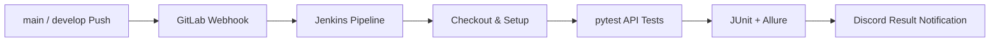

# QA Automation & CI/CD Portfolio

API 기능 테스트, 부하 테스트 관찰, Jenkins 기반 CI/CD와 Allure·Discord 결과 알림을 수행한 4인 팀 프로젝트의 포트폴리오용 저장소입니다.

> 이 저장소는 원본 저장소를 그대로 복제하지 않았습니다. 실제 서비스 주소, 계정, 토큰, 웹훅, 서버 IP, Git 이력과 팀원 개인정보를 제거한 뒤 제가 담당한 설계와 코드를 중심으로 재구성했습니다.

## 프로젝트 개요

| 구분 | 내용 |
| --- | --- |
| 목표 | API 기능 품질 검증과 반복 가능한 자동 테스트·결과 공유 체계 구축 |
| 수행 형태 | QA 4인 팀 프로젝트 |
| 주요 도구 | Python, pytest, Requests, Allure, Jenkins, GitLab Webhook, Discord Webhook, JMeter, htop |
| 테스트 관점 | 정상·예외·권한·경계값, 알려진 결함의 XFail 관리, 부하 생성기 리소스 분리 관찰 |
| 공개 범위 | 담당 코드 샘플, 익명화된 설계·운영 문서, 검증 가능한 알림 모듈 단위 테스트 |

## 담당 영역

| 영역 | 기여 내용 | 저장소에서 확인할 위치 |
| --- | --- | --- |
| 클래스 홈 API | API Object와 정상·예외·권한·경계값 테스트 설계, pytest 마커 및 Allure 제목 적용 | [`examples/class_home`](examples/class_home), [`docs/MY_CONTRIBUTIONS.md`](docs/MY_CONTRIBUTIONS.md) |
| CI/CD | `main`·`develop` Push Webhook을 Jenkins 빌드로 연결하고 테스트·리포트·알림 파이프라인 구성 | [`ci/Jenkinsfile.example`](ci/Jenkinsfile.example), [`docs/CI_CD.md`](docs/CI_CD.md) |
| 결과 알림 | JUnit/Allure 결과를 파싱해 성공·실패·XFail과 리포트 링크를 Discord로 전송 | [`tools/send_discord_report.py`](tools/send_discord_report.py), [`tests/test_ci_notification.py`](tests/test_ci_notification.py) |
| 부하 테스트 관찰 | 5→10→20→30명 단계에서 부하 생성 VM의 CPU·메모리를 관찰해 서버 지연과 클라이언트 병목을 구분 | [`docs/LOAD_TEST.md`](docs/LOAD_TEST.md) |
| 운영·공유 | Jenkins/VM 사용 방법과 장애 대응 순서를 문서화하고 팀원 대상 화면 공유 진행 | [`docs/TROUBLESHOOTING.md`](docs/TROUBLESHOOTING.md) |

## 자동화 흐름



- Merge Request 생성만으로는 실행하지 않고, `main` 또는 `develop`에 실제 Push가 반영될 때 실행되도록 제한했습니다.
- Jenkins Credentials에 테스트 계정과 Discord Webhook을 저장하고 파이프라인에서는 환경변수로만 주입했습니다.
- 최종 `develop` 검증에서는 `103 passed, 4 xfailed` 결과를 확인했습니다. 이는 종료 시점의 비공개 테스트 환경 결과이며 현재 저장소에서 외부 서비스 없이 재현되는 수치는 아닙니다.

## 핵심 설계 포인트

1. HTTP 200만으로 성공을 판단하지 않고 응답 본문의 업무 상태도 함께 확인했습니다.
2. 인증 없음, 잘못된 식별자, 기관 간 접근, 역할별 수정 권한 등 권한 경계를 테스트했습니다.
3. 재현된 서버 명세 불일치는 무조건 통과시키지 않고 `XFail`로 분리해 알려진 결함으로 추적했습니다.
4. CI 알림은 JUnit의 일반 Skip과 pytest XFail을 구분하고, 실패 테스트는 Allure 제목으로 읽기 쉽게 변환했습니다.
5. 부하 테스트에서는 서버 지표 접근 권한의 한계를 명시하고, JMeter 실행 VM의 자원 사용량과 실제 브라우저 체감을 보조 근거로 사용했습니다.

## 로컬에서 확인하기

이 저장소에서 바로 실행 가능한 범위는 Discord 알림 모듈의 단위 테스트입니다. 실제 웹훅 전송은 테스트에서 모킹되므로 외부 메시지를 보내지 않습니다.

```bash
python -m venv .venv
source .venv/bin/activate        # Windows: .venv\Scripts\activate
pip install -r requirements.txt
python -m pytest
```

클래스 홈 파일은 외부 비공개 API와 공통 팀 프레임워크에 의존하므로 실행 예제가 아닌 설계·코드 리뷰용 샘플입니다.

## 저장소 구조

```text
.
├─ ci/                         # 비밀값을 제거한 Jenkins Pipeline 예시
├─ docs/                       # 기여 내용, CI/CD, 부하 테스트, 장애 대응, 공개 점검
├─ examples/class_home/        # 담당 API Object 및 대표 테스트 패턴
├─ tests/                      # CI 알림 모듈 단위 테스트
├─ tools/                      # JUnit/Allure 파싱 및 Discord 메시지 생성
├─ NOTICE.md                   # 팀 프로젝트 저작권·공개 범위 고지
└─ SECURITY.md                 # 제외 대상과 비밀정보 관리 원칙
```

## 보안 및 공개 원칙

- 실제 계정·비밀번호·토큰·Webhook URL·Jenkins/GitLab 주소·VM IP를 포함하지 않습니다.
- 원본 Git 이력을 가져오지 않아 과거 커밋의 이메일이나 삭제된 비밀값이 노출되지 않습니다.
- JTL, Allure 원본, Jenkins 빌드 로그와 스크린샷은 요청·응답 데이터 및 내부 주소 노출 가능성 때문에 제외했습니다.
- 팀 공동 산출물은 공개 전 팀원 및 교육기관의 공개 가능 범위를 확인해야 합니다.

세부 점검 항목은 [`docs/PUBLICATION_CHECKLIST.md`](docs/PUBLICATION_CHECKLIST.md)를 참고하세요.

## 문서 바로가기

- [내 기여 범위와 근거](docs/MY_CONTRIBUTIONS.md)
- [Jenkins/CI-CD 설계 및 안전한 이전 방법](docs/CI_CD.md)
- [부하 테스트 클라이언트 모니터링](docs/LOAD_TEST.md)
- [주요 트러블슈팅](docs/TROUBLESHOOTING.md)
- [공개 전 체크리스트](docs/PUBLICATION_CHECKLIST.md)
