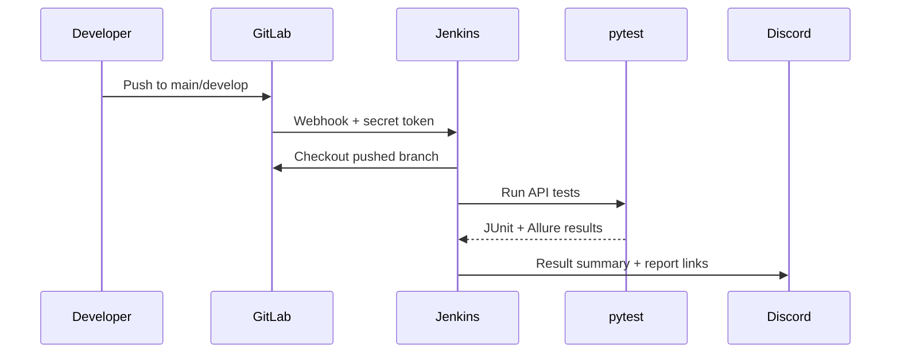

# Jenkins CI/CD 설계와 이전 방법

## 목표

`main` 또는 `develop`에 Push가 반영되면 Jenkins가 해당 브랜치를 Checkout하고 API 테스트를 실행한 뒤 Allure 리포트와 Discord 요약을 제공하도록 구성했습니다.



## 브랜치 실행 정책

| 이벤트 | 실행 여부 | 이유 |
| --- | --- | --- |
| `develop` Push | 실행 | 통합 단계 회귀 테스트 |
| `main` Push | 실행 | 최종 배포 기준 회귀 테스트 |
| Feature Push | 실행하지 않음 | 불필요한 공유 DEV 부하 방지 |
| Merge Request 생성 | 실행하지 않음 | 현재 정책은 실제 대상 브랜치 반영 후 검증 |

GitLab과 Jenkins 양쪽에서 `^(main|develop)$` 정규식을 적용해 이중으로 제한합니다. Jenkins는 Webhook의 source branch 값을 Checkout에 사용하므로 `main` Push는 `main`, `develop` Push는 `develop`에서 실행됩니다.

## 파이프라인 단계

1. **Checkout**: 허용된 브랜치인지 확인하고 SCM Credential로 소스 Checkout
2. **Setup**: Python 가상환경과 테스트 의존성 설치
3. **API Test**: Jenkins Credentials의 테스트 계정을 환경변수로 주입하고 pytest 실행
4. **Report**: JUnit 결과 게시, Allure 결과 생성, 필요한 산출물 보관
5. **Notify**: Discord Webhook을 일시적으로 주입해 테스트 요약과 링크 전송
6. **Cleanup**: Workspace에서 자격증명 흔적과 생성 파일 정리

비밀값을 제거한 예시는 [`../ci/Jenkinsfile.example`](../ci/Jenkinsfile.example)에서 확인할 수 있습니다.

## Jenkins 서버 내용을 포트폴리오로 옮기는 방법

실제 Jenkins 서버의 `$JENKINS_HOME`을 GitHub에 올리지 않습니다. 서버 백업에는 암호화된 자격증명, Secret Key, 사용자 정보, 내부 URL, Build Workspace와 로그가 포함될 수 있습니다.

대신 다음 자료로 재현성을 설명합니다.

- 비밀값을 일반화한 `Jenkinsfile.example`
- 필요한 Plugin 이름과 용도
- Job의 Trigger/Branch Filter 설정값
- Credential의 **종류와 변수명**만 기록한 표
- Webhook → Checkout → Test → Report → Notification 흐름도
- 403/401/네트워크 바인딩 문제의 원인과 해결 원칙
- 검증 결과의 익명화된 요약

### 공개 가능한 Plugin 목록 예시

- GitLab Plugin: Push Webhook 수신과 이벤트 변수 제공
- Pipeline: Declarative Pipeline 실행
- Git Plugin: SCM Checkout
- Allure Jenkins Plugin: Allure 결과 게시
- JUnit: 테스트 결과 추세와 실패 표시
- Credentials Binding: 실행 시점의 비밀값 주입

버전은 공개 당시 지원 상태가 달라질 수 있으므로, 실제 서버에서 확인한 뒤 민감한 환경 정보 없이 별도 표로 기록하는 편이 좋습니다.

## 새 Jenkins에서 재구성하는 순서

1. Jenkins와 필요한 Plugin을 설치합니다.
2. Jenkins가 외부 Webhook을 받아야 한다면 방화벽·보안그룹·Reverse Proxy를 최소 범위로 엽니다.
3. 서비스 Listen Address는 필요한 네트워크 범위에 맞춥니다. `0.0.0.0`은 모든 인터페이스 수신을 의미하므로 인증, 방화벽, 접근제어와 함께 사용해야 합니다.
4. Jenkins Root URL에는 사용자가 접근 가능한 HTTPS 주소를 설정합니다.
5. SCM, 테스트 계정, Discord Webhook을 Credentials에 등록합니다.
6. Pipeline Job을 만들고 Repository URL, Script Path, Trigger를 설정합니다.
7. GitLab Webhook URL과 Secret Token을 등록합니다.
8. `main`·`develop` Push 각각으로 Checkout 브랜치와 알림 내용을 검증합니다.
9. 자격증명 마스킹과 Workspace 정리를 확인합니다.

## 저장하면 안 되는 Jenkins 파일

```text
$JENKINS_HOME/credentials.xml
$JENKINS_HOME/secrets/**
$JENKINS_HOME/users/**
$JENKINS_HOME/jobs/**/builds/**
$JENKINS_HOME/workspace/**
SSH private keys
API tokens / webhook secrets
raw config backups containing internal URLs
```

서버를 정말 백업해야 한다면 암호화된 별도 보관소와 접근 통제를 사용해야 하며, 포트폴리오 Git 저장소와 분리해야 합니다.
